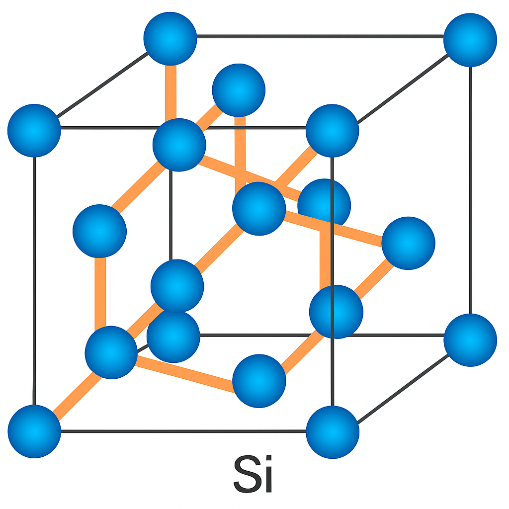

# 01. シリコンの結晶構造とドーピング

## 📘 概要

この章では、シリコン（Si）の結晶構造と、電気的性質を制御する「ドーピング」技術について学びます。  
特に、**P型／N型半導体の形成原理とキャリアの違い**を図解で直感的に理解することが目標です。

---

## 1. Si結晶構造と真性半導体

シリコンは4価の共有結合によって安定した**ダイヤモンド構造の結晶**を形成します。  
この状態では、すべての価電子が結合に使われ、自由電子はほとんど存在しません。

- → この状態を「**真性半導体（intrinsic）**」と呼びます。
- → キャリアは**熱励起によってわずかに生成**される（抵抗率は高い）。

### 【図解】Siの結晶構造  

---

## 2. ドーピングによる抵抗率制御

ドーピングとは、**シリコンに微量の不純物を添加**し、電気特性を調整する技術です。

- 目的：**キャリア（電子または正孔）の種類と密度**を制御すること
- 加える不純物によって、以下のように分類されます：

| ドーピング元素 | 型 | 多数キャリア | 抵抗率変化 |
|----------------|----|---------------|-------------|
| なし（Si純粋） | 真性 | e⁻ = h⁺（同数）| 高抵抗 |
| ホウ素（B）     | P型 | 正孔 h⁺        | 抵抗↓ |
| リン（P）       | N型 | 電子 e⁻        | 抵抗↓ |

---

## 【図解】シリコンの抵抗率制御とドーピング  

- 左：ホウ素を加えた **P型半導体**（電子欠乏 → 正孔発生）  
- 中央：添加なしの **真性Si**（電気的中性で高抵抗）  
- 右：リンを加えた **N型半導体**（余剰電子 → 導電性向上）

---

## 3. P型とN型の動作原理

### 🔹 P型半導体（アクセプタ）

- 添加元素：**ホウ素（B）**  
- 価電子が1つ少なく、**正孔（h⁺）**が生成される
- キャリア：正孔が主役（多数キャリア）

### 🔹 N型半導体（ドナー）

- 添加元素：**リン（P）**  
- 価電子が1つ多く、**自由電子（e⁻）**が供給される
- キャリア：電子が主役（多数キャリア）

---

## 4. 実装技術とドーピング濃度

| 技術      | 特徴 |
|-----------|------|
| 拡散      | 高温加熱により表面から内部へ不純物拡散 |
| イオン注入 | 加速した不純物イオンをSi基板に打ち込む（精密制御） |

- 通常は 10¹⁴〜10¹⁸ cm⁻³ 程度の濃度で制御
- → 濃度が高いほど導電性が向上（抵抗低下）

---

## 5. N型とP型の比較表

| 特性         | N型                 | P型                   |
|--------------|---------------------|------------------------|
| 多数キャリア | 電子（e⁻）          | 正孔（h⁺）            |
| ドーピング元素 | リン（P）など        | ホウ素（B）など        |
| エネルギー準位 | ドナー準位（伝導帯近傍）| アクセプタ準位（価電子帯近傍） |
| 導電メカニズム | 電子の移動          | 正孔の移動            |

---

## 6. 本章のまとめと次章への導入

- **真性Siは高抵抗** → ドーピングで導電性制御
- **N型：電子多い**, **P型：正孔多い**  
- 次章 `02_carrier_dynamics.md` では、  
　**電子や正孔がどのように生成・移動・再結合するか**  
　— キャリアの「動き」を学びます。
