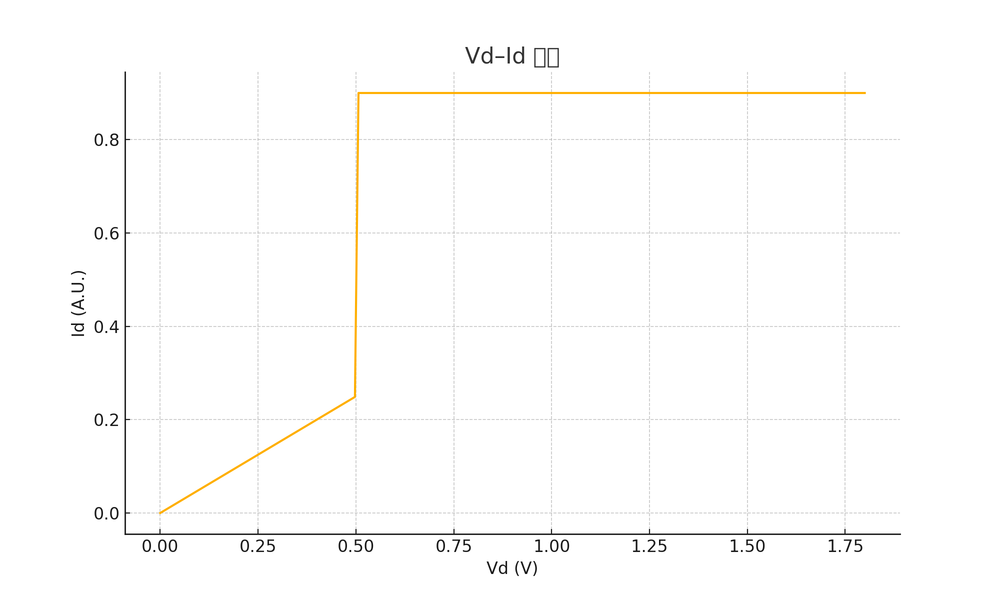
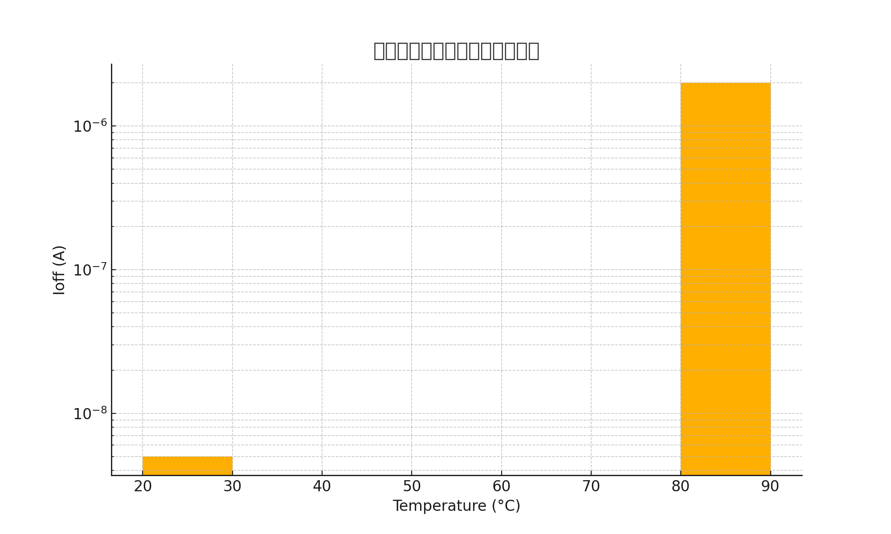
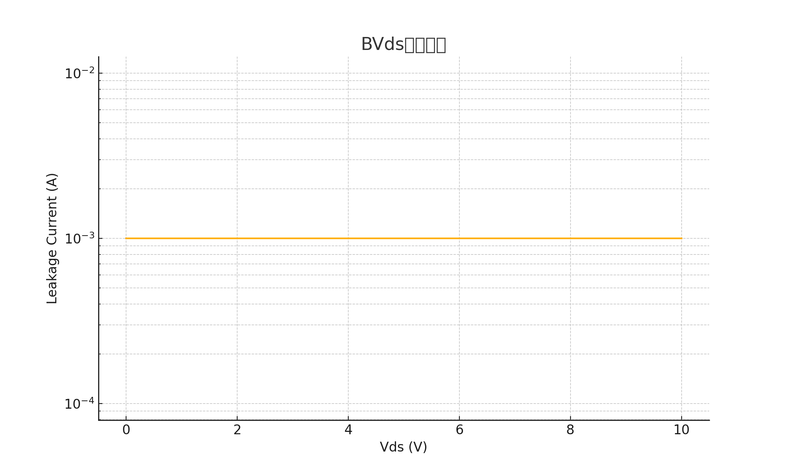
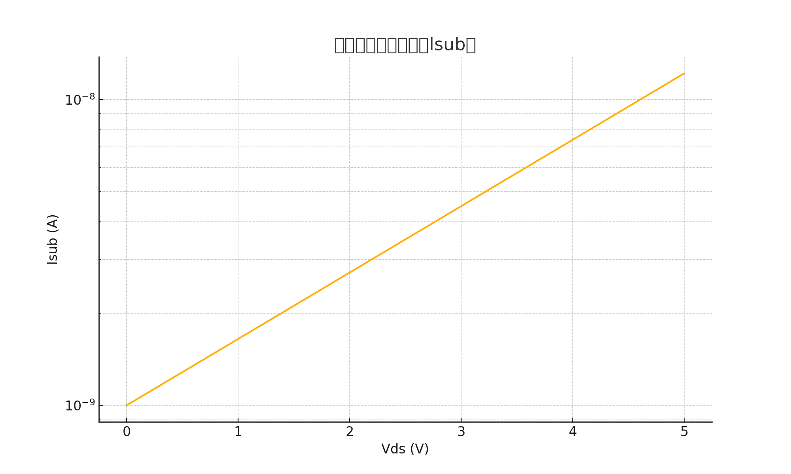
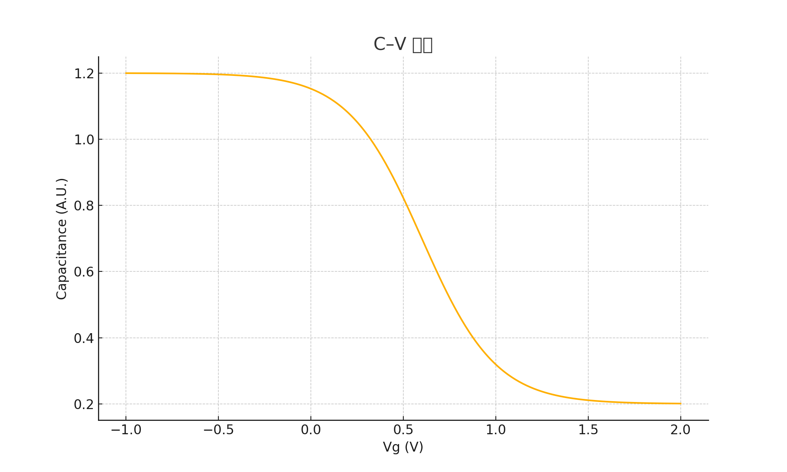

# MOSFET特性図（0.18µm, 1.8V CMOS）

本資料は、0.18µmプロセス・1.8V動作のNMOS/PMOSデバイスにおける基本電気特性をまとめたものです。

---

## 1. Vg–Id 特性（しきい値・gmmax評価用）

- nMOS, pMOSのしきい値（Vth）とgm最大点が視覚的に分かる。
- 実測/シミュレーション比較用。

---

## 2. Vd–Id 特性（飽和・リニア領域）

- Vds変化によるId挙動を確認。
- 飽和領域とリニア領域の分離が可能。

---

## 3. Ioff（サブスレッショルドリーク電流）

- 25°Cと85°Cにおけるオフリーク電流。
- 数nA〜μAオーダー、温度依存を確認可能。

---

## 4. BVDS（ドレイン–ソース耐圧）

- パワーMOS設計時のブレークダウン特性の目安。
- 通常、5V以上が確保される。

---

## 5. Isub（ボディリーク電流・ホットキャリア評価）

- Vds依存の基板電流を評価。
- ホットキャリア劣化（HCI）検討用にも有用。

---

## 6. C–V特性（MOS容量とVg依存性）

- ゲート電圧に対するMOS容量の変化。
- しきい値電圧やチャネル形成を評価可能。
