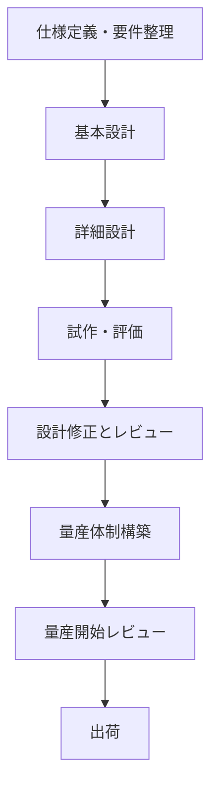

# 第5章 製品開発チェックフロー（教育用）

## 5.1 開発フローの全体像

インクジェット技術を活用した製品（プリントヘッドやシステム）は、以下のような開発工程を経て完成します。各工程には明確な目的と確認事項があり、品質・安全・コスト・納期の観点からのチェックが必要です。

## 5.2 試作と構成管理

インクジェット製品の開発では、量産前に複数回の試作を行い、構造・制御・信頼性の検証を実施します。  
その際には以下のような構成管理の考え方が重要です。

### 🧩 試作構成の管理ポイント

- **構成BOM（試作版）**を明示し、量産版との違いを明確にする
- **部品コード**は試作用（仮コード）でも一元管理し、後に正式コードへ移行
- **流用品／新規部品の区分**を行い、変更履歴を明示する
- **構成差分表**により、前回試作との差分と理由を記録する

### 🛠️ 試作タグの例

| タグ | フェーズ           | 主な目的               |
|------|--------------------|------------------------|
| EVT  | 機能試作           | 動作確認、基本特性評価 |
| DVT  | 設計妥当性検証     | 信頼性・安全性評価     |
| PVT  | 量産直前構成試作   | 工程・検査の最終確認   |

---

## 5.3 評価レポートと技術確認

試作が完了したら、設計妥当性や製品性能に関する評価を実施し、レポートとして記録します。  
レポートは、設計・品質・製造など多部門で共有され、設計是正の判断材料となります。

### 📋 評価内容の例

- **機能評価**：吐出波形、応答時間、印字パターン確認
- **信頼性試験**：高温高湿、温度サイクル、耐久動作
- **環境適合**：RoHS/REACH 該当確認、含有証明の有無
- **印字品質**：ドット抜け、斜め印字、吐出のばらつき

### 🗂 レポート構成例

1. 評価目的と概要  
2. 使用試作品構成（型番、ロット、構成差分）  
3. 評価条件と方法（環境・時間・駆動パターン）  
4. 測定結果（グラフ・写真・定量データ）  
5. 考察と結論（設計へのフィードバック）

---

## 5.4 デザインレビューと量産Gate

試作で問題がないと判断された段階で、製品としての最終確認を行う「Gateレビュー」を実施します。

### ✅ デザインレビュー（DR）

- 設計観点での妥当性確認
- 図面・BOM・材料構成・インタフェース整合性の確認
- 改訂履歴と設計変更の理由を明確化

### ✅ 量産開始Gate（MPG）

- 多部門（製造・品質・調達・環境）による最終確認
- チェック項目：
  - 評価レポートに基づく設計妥当性
  - 工程FMEA、検査仕様書の整備
  - 環境証明書（chemSHERPA など）
  - 該非判定、輸出対応確認

---

## 5.5 教育演習とチェックリスト活用

本章の内容を教育目的で活用するため、演習やレビュー練習のためのチェックリストを提供します。

### 🎓 教育用チェックリスト（例）

| カテゴリ       | チェック項目                         | 判定 | コメント     |
|----------------|--------------------------------------|------|--------------|
| 試作準備       | 使用部品の型番・数量が確定しているか | ○    | 問題なし     |
| 試作BOM登録    | 仮部品コードで構成表が作成されたか   | △    | 1点未登録あり |
| 評価記録       | 試験データと写真が保存されているか   | ○    | Dropbox保存済 |
| 環境情報       | chemSHERPAデータが登録されたか        | ×    | 未取得        |
| 該非判定       | 該非判定票が出力済か                  | ○    | 社内DBに登録済 |

テンプレートファイル：`templates/inkjet_dev_checklist.xlsx`

### 📚 活用方法

- 授業内での模擬レビュー実習
- 卒業研究における製品評価記録のフレームとして活用
- 社内研修での開発プロセス教育に活用可能

---

## 📝 補足

本章の内容は、一般的な製品開発プロセスと教育目的に基づき構成されています。  
特定の企業・製品仕様に関する機密情報は含まれていません。
